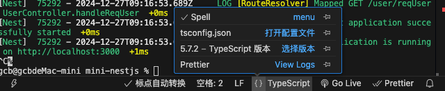

[Nest 体系课](https://www.bilibili.com/video/BV1VYs8eFEjh?spm_id_from=333.788.player.switch&vd_source=41ed998ac767425fb616fd9071ce9682&p=15)

## 装饰器

ts 的装饰在不同版本的 typescript 上写法会有所不同,因为,ts 的装饰器是一个实验性的特性,一般一个特性要正式实装,需要经过五个阶段,分别是 设想(stage0),提案(stage1),草案(stage2),候选(stage3),完成.

在 ts4 下,装饰器处于 stage2 阶段,写法也就是

```ts
// 类装饰器
function ClassDecorator(target: any) {}
// 方法装饰器
function MethodDecorator(
  target: any,
  propertyKey: string,
  descriptor: PropertyDescriptor
) {}
// 访问器装饰器
function ConfigDecorator(
  target: any,
  propertyKey: string,
  descriptor: PropertyDescriptor
) {}
// 属性装饰器
function PropertyDecorator(target: any, propertyKey: string) {}
// 参数装饰器
function ParamDecorator(
  target: any,
  propertyKey: string,
  parameterIndex: number
) {}
```

并切需要在 `tsconfig.json` 中开启 `experimentalDecorators` 选项.如果要使用`metadata` 元数据,还需要开启 `emitDecoratorMetadata` 选项.

而在 ts5 下,装饰器处于 stage3 阶段,全部装饰器都接受两个参数，一个是 value，另一是 context

- value：所装饰的对象。
- context：上下文对象，TypeScript 提供一个原生接口 ClassMethodDecoratorContext，描述这个对象。

```ts
type Decorator = (
  value: DecoratedValue,
  context: {
    kind: string; // 表示所装饰对象的类型,可能取以下的值 'class'|'method'|'getter'|'setter'|'field'|'accessor'
    name: string | symbol; //字符串或者 Symbol 值，所装饰对象的名字，比如类名、属性名等
    addInitializer?(initializer: () => void): void; //用来添加类的初始化逻辑。以前，这些逻辑通常放在构造函数里面，对方法进行初始化，现在改成以函数形式传入 addInitializer()方法。注意，addInitializer()没有返回值。
    static?: boolean; //表示所装饰的对象是否为类的静态成员。
    private?: boolean; //表示所装饰的对象是否为类的私有成员。
    metadata: any; // 表示设置的元数据
    access: {
      get?(): unknown;
      set?(value: unknown): void;
    }; //包含了某个值的 get 和 set 方法。
  }
) => void | ReplacementValue;

function Decorator(value: any, context: ClassMethodDecoratorContext) {}
```

要使用 stage3 的装饰器,首先需要安装 typescript@5 版本. 然后将`tsconfig.json`中的`experimentalDecorators`和`emitDecoratorMetadata`注释掉. 如果在 vscode 中使用还需要确保 vscode 使用的 typescript 和 tsServer 版本也是 5 以上的版本. 因为 tsServer 是 ts 的语言服务,用来检查代码的,果使用的是旧版本的 tsServer,会导致 vscode 无法识别装饰器. tsServer 内部会调用 SDK 进行检查,这个 SDK 是可以设置的

通过 `ctrl + shift + p` 打开命令面板,打开用户设置面板,搜索`tsdk`,比如要设置项目中安装的 typescript 作为 SDK,就可以填写路径`./node_modules/typescript/lib`.(配置完之后记得重启一下 vscode,可以`ctrl + shift + p`打开命令面板,输入`reload window`)

也可以直接在 vscode 的又下角点击 `{}TypeScrip` 的 `{}`进行切换,或者通过 `ctrl + shift + p` 打开命令面板,输入`TypeScript: Select TypeScript version`,选择要使用的版本.



如果只想改项目中的 tsServer 的 sdk,可以在项目的根目录下创建一个`.vscode/settings.json`文件,在文件中添加`"typescript.tsdk": "./node_modules/typescript/lib"`即可.

## IOC 和 DI

IOC: 控制反转,是一种设计模式,它的核心思想是将对象的创建和依赖关系的管理交给容器,而不是在代码中直接创建对象.

DI: 依赖注入,是一种实现 IOC 的方式,它的核心思想是将对象的依赖关系从代码中解耦出来,由容器来负责创建和管理对象的依赖关系,程序不再主动创建对象,而是被动的接受容器注入的对象

传统的方式

```ts
class Engine {
  start() {
    console.log("引擎启动");
  }
}
class Car {
  private engine: Engine;
  constructor() {
    this.engine = new Engine();
  }
  drive() {
    this.engine.start();
  }
}

const car = new Car();
car.drive();
```

IOC 的方式

```ts
class Engine {
  start() {
    console.log("引擎启动");
  }
}
class Car {
  private engine: Engine;
  constructor(engine: Engine) {
    this.engine = engine;
  }
  drive() {
    this.engine.start();
  }
}
const engine = new Engine();
const car = new Car(engine);
car.drive();
```

通过 DI 方式实现 IOC

```ts
import "reflect-metadata";

// 定义一个装饰器,用来标记类
function Injectable(target: any) {
  // 这里面可以不用写任何代码，此装饰器不需要执行任何操作，仅仅用于元数据的生成
  // 只要使用了这个装饰器 reflect-metadata 就会存储一些信息，包括
  // 类型元数据使用元数据键"design:type"。
  // 参数类型元数据使用元数据键"design:paramtypes"。
  // 返回类型元数据使用元数据键"design:returntype"。
  // https://zhuanlan.zhihu.com/p/42220487
}

@Injectable
class Oil {
  constructor(public price: number) {}
}

@Injectable
class Engine {
  constructor(private oil: Oil, private power: number) {}
  start() {
    console.log("引擎启动");
  }
}

@Injectable
class Car {
  constructor(private engine: Engine) {}
  drive() {
    this.engine.start();
  }
}

// 定义一个 DI 容器,用来管理对象的依赖关系
class DIContainer {
  private services = new Map<string, any>();
  // 注册服务,用来保存依赖
  register<T>(name: string, service: any) {
    this.services.set(name, service);
  }
  // 解析服务,取出服务
  resolve<T>(name: string): T {
    const Service = this.services.get(name);
    if (!Service) {
      throw new Error(`Service ${name} not found`);
    }
    if (Service instanceof Function) {
      // 是一个类
      // 获取实现类的构造函数参数的类型数组
      // 通过 @Injectable() 装饰器注入的依赖
      const dependencies =
        Reflect.getMetadata("design:paramtypes", Service) ?? []; // [Engine]
      // 递归解析依赖
      const injections = dependencies.map((dependency: any) =>
        this.resolve(dependency.name)
      );
      // 创建服务实例
      return new Service(...injections);
    } else if (Service.useFactory) {
      // 是一个类的工厂方法
      const params = Service.inject || [];
      return Service.useFactory(...params);
    } else if (Service.useValue) {
      // 是一个类的实例
      return Service.useValue;
    }
  }
}

// 创建 DI 容器
const container = new DIContainer();
// 当类的构造方法除了需要注入的依赖之外,还需要其他的参数时,可以使用 useFactory 方法 和 useValue 方法
container.register<Oil>("Oil", {
  provide: "Oil",
  inject: [100],
  useFactory: (price: number) => {
    return new Oil(price);
  },
});
container.register<Engine>("Engine", {
  provide: "Engine",
  useValue: new Engine(new Oil(200), 180),
});
container.register<Car>("Car", Car);
const car = container.resolve<Car>("Car");
car.drive();
```

**`reflect-metadata`的`defineMetadata`基本原理**

```js
// 在全局中维护一个存储区域
const metadataMap = new Map();
function defineMetadata(key, value, target, propertyKey) {
  if (!metadataMap.get(target)) {
    metadataMap.set(target, new Map());
  }
  const targetMetadata = metadataMap.get(target);
  if (!targetMetadata.get(propertyKey)) {
    targetMetadata.set(propertyKey, new Map());
  }
  const propertyMetadata = targetMetadata.get(propertyKey);
  propertyMetadata.set(key, value);
}
```

## SOLID 原则

SOLID 原则是面向对象编程中的五个基本原则,它们分别是:

- 单一职责原则(SRP): 一个类应该只有一个引起它变化的原因.
- 开放封闭原则(OCP): 一个类应该对扩展开放,对修改封闭.
- 里氏替换原则(LSP): 子类应该能够替换它们的基类(IS-A).
- 接口隔离原则(ISP): 一个类不应该依赖它不需要的接口.
- 依赖倒置原则(DIP): 高层模块不应该依赖低层模块,两者都应该依赖抽象.

## Provider

nestjs 中的 Provider 就是通过 IOC 和 DI 实现的.
